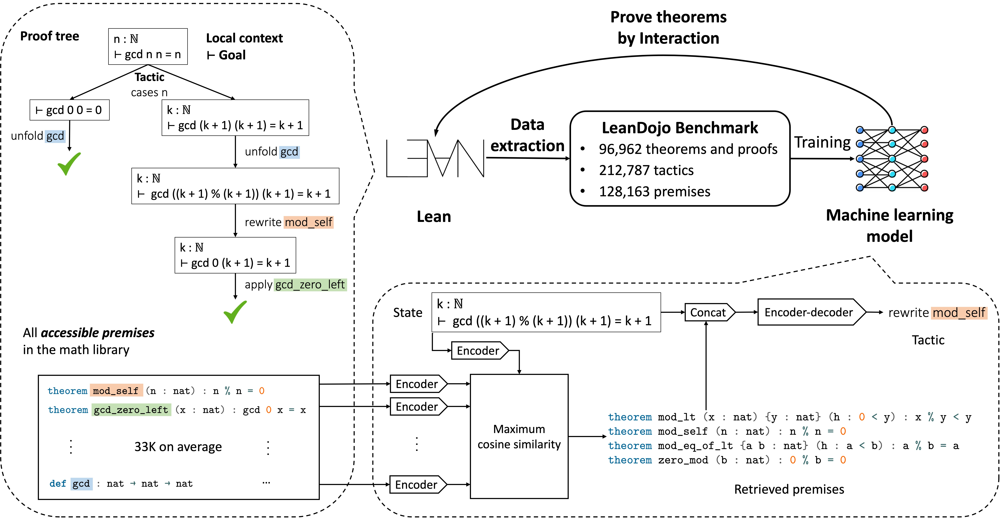

# Retrieval-Augmented Prover (ReProver)



Code for the paper:  

[LeanDojo: Theorem Proving with Retrieval-Augmented Language Models](https://leandojo.org/)      
NeurIPS (Datasets and Benchmarks Track), 2023, Oral presentation  
[Kaiyu Yang](https://yangky11.github.io/), [Aidan Swope](https://aidanswope.com/about), [Alex Gu](https://minimario.github.io/), [Rahul Chalamala](https://rchalamala.github.io/),  
[Peiyang Song](https://peiyang-song.github.io/), [Shixing Yu](https://billysx.github.io/), [Saad Godil](https://www.linkedin.com/in/saad-godil-9728353/), [Ryan Prenger](https://www.linkedin.com/in/ryan-prenger-18797ba1/), [Anima Anandkumar](http://tensorlab.cms.caltech.edu/users/anima/)

```bibtex
@inproceedings{yang2023leandojo,
  title={{LeanDojo}: Theorem Proving with Retrieval-Augmented Language Models},
  author={Yang, Kaiyu and Swope, Aidan and Gu, Alex and Chalamala, Rahul and Song, Peiyang and Yu, Shixing and Godil, Saad and Prenger, Ryan and Anandkumar, Anima},
  booktitle={Neural Information Processing Systems (NeurIPS)},
  year={2023}
}
```

[](https://github.com/MineDojo/MineDojo/blob/main/LICENSE) [](https://github.com/psf/black)


## Quick Links

  - [LeanDojo Website](https://leandojo.org/)
  - [Using Trained Models on Hugging Face](#using-trained-models-on-hugging-face)
  - [Using the Model Directly in Lean](#using-the-model-directly-in-lean)
  - [Requirements](#requirements)
  - [Premise Selection](#premise-selection)
  - [Theorem Proving](#theorem-proving)
  - [Questions and Bugs](#questions-and-bugs)


## Using Trained Models on Hugging Face

| Model name | Model architecture | Training data | Input | Output |
| ---------- | ------------------ | ------------- | ----- | ------ |
| [kaiyuy/leandojo-lean3-tacgen-byt5-small](https://huggingface.co/kaiyuy/leandojo-lean3-tacgen-byt5-small) | ByT5 (encoder-decoder) | LeanDojo Benchmark (Lean 3) | Proof state | Tactic |
| [kaiyuy/leandojo-lean3-retriever-byt5-small](https://huggingface.co/kaiyuy/leandojo-lean3-retriever-byt5-small) | ByT5 (encoder-only) | LeanDojo Benchmark (Lean 3) | Proof state | Embedding |
| [kaiyuy/leandojo-lean3-retriever-tacgen-byt5-small](https://huggingface.co/kaiyuy/leandojo-lean3-retriever-tacgen-byt5-small) | ByT5 (encoder-decoder) | LeanDojo Benchmark (Lean 3) | Retrieved premises + proof state | Tactic |
| [kaiyuy/leandojo-lean4-tacgen-byt5-small](https://huggingface.co/kaiyuy/leandojo-lean4-tacgen-byt5-small) | ByT5 (encoder-decoder)  | LeanDojo Benchmark 4 (Lean 4) | Proof state | Tactic |
| [kaiyuy/leandojo-lean4-retriever-byt5-small](https://huggingface.co/kaiyuy/leandojo-lean4-retriever-byt5-small) | ByT5 (encoder-only) | LeanDojo Benchmark (Lean 4) | Proof state | Embedding |
| [kaiyuy/leandojo-lean4-retriever-tacgen-byt5-small](https://huggingface.co/kaiyuy/leandojo-lean4-retriever-tacgen-byt5-small) | ByT5 (encoder-decoder) | LeanDojo Benchmark (Lean 4) | Retrieved premises + proof state | Tactic |

Our trained models are available on HuggingFace Hub. With minimum dependencies (only [PyTorch](https://pytorch.org/) and [HuggingFace Transformers](https://huggingface.co/docs/transformers/index)), you can use our models to perform inference, finetune them on your own data, or plug them into your customized theorem proving pipeline. Below are some examples.


### Tactic Generator

Our tactic generator is a [ByT5](https://huggingface.co/docs/transformers/model_doc/byt5) model finetuned to generate tactics given a proof state.
```python
from transformers import AutoTokenizer, AutoModelForSeq2SeqLM

tokenizer = AutoTokenizer.from_pretrained("kaiyuy/leandojo-lean3-tacgen-byt5-small")       # Or "lean3" -> "lean4"
model = AutoModelForSeq2SeqLM.from_pretrained("kaiyuy/leandojo-lean3-tacgen-byt5-small")   # Or "lean3" -> "lean4"

state = "n : ℕ\n⊢ gcd n n = n"
tokenized_state = tokenizer(state, return_tensors="pt")

# Generate a single tactic.
tactic_ids = model.generate(tokenized_state.input_ids, max_length=1024)
tactic = tokenizer.decode(tactic_ids[0], skip_special_tokens=True)
print(tactic, end="\n\n")

# Generate multiple tactics via beam search.
tactic_candidates_ids = model.generate(
    tokenized_state.input_ids,
    max_length=1024,
    num_beams=4,
    length_penalty=0.0,
    do_sample=False,
    num_return_sequences=4,
    early_stopping=False,
)
tactic_candidates = tokenizer.batch_decode(
    tactic_candidates_ids, skip_special_tokens=True
)
for tac in tactic_candidates:
    print(tac)
```

The expected output is shown below. `<a>` and `</a>` are markers of premises in generated tactics. You should remove them when using the tactics.
```
cases n

cases n
simp [<a>nat.gcd</a>]
rw <a>nat.gcd_comm</a>
by_cases hn : n = 0
```


### Premise Retriever

At the core of our premise retriever is a ByT5 encoder that embeds states and premises into vectors. You can 
use the vectors to perform retrieval by maximizing cosine similarity.
```python
import torch
from typing import Union, List
from transformers import AutoTokenizer, AutoModelForTextEncoding

tokenizer = AutoTokenizer.from_pretrained("kaiyuy/leandojo-lean3-retriever-byt5-small")
model = AutoModelForTextEncoding.from_pretrained("kaiyuy/leandojo-lean3-retriever-byt5-small")

state = "n : ℕ\n⊢ gcd n n = n"
premises = [
  "<a>vsub_eq_zero_iff_eq</a> @[simp] lemma vsub_eq_zero_iff_eq {p1 p2 : P} : p1 -ᵥ p2 = (0 : G) ↔ p1 = p2",
  "<a>is_scalar_tower.coe_to_alg_hom'</a> @[simp] lemma coe_to_alg_hom' : (to_alg_hom R S A : S → A) = algebra_map S A",
  "<a>polynomial.X_sub_C_ne_zero</a> theorem X_sub_C_ne_zero (r : R) : X - C r ≠ 0",
  "<a>forall_true_iff</a> theorem forall_true_iff : (α → true) ↔ true",
  "def <a>nat.gcd</a> : nat → nat → nat\n| 0        y := y\n| (succ x) y := have y % succ x < succ x, from mod_lt _ $ succ_pos _,\n                gcd (y % succ x) (succ x)",
  "@[simp] theorem <a>nat.gcd_zero_left</a> (x : nat) : gcd 0 x = x",
  "@[simp] theorem <a>nat.gcd_succ</a> (x y : nat) : gcd (succ x) y = gcd (y % succ x) (succ x)",
  "@[simp] theorem <a>nat.mod_self</a> (n : nat) : n % n = 0",
]  # A corpus of premises to retrieve from.

@torch.no_grad()
def encode(s: Union[str, List[str]]) -> torch.Tensor:
    """Encode texts into feature vectors."""
    if isinstance(s, str):
        s = [s]
        should_squeeze = True
    else:
        should_squeeze = False
    tokenized_s = tokenizer(s, return_tensors="pt", padding=True)
    hidden_state = model(tokenized_s.input_ids).last_hidden_state
    lens = tokenized_s.attention_mask.sum(dim=1)
    features = (hidden_state * tokenized_s.attention_mask.unsqueeze(2)).sum(dim=1) / lens.unsqueeze(1)
    if should_squeeze:
      features = features.squeeze()
    return features

@torch.no_grad()
def retrieve(state: str, premises: List[str], k: int) -> List[str]:
    """Retrieve the top-k premises given a state."""
    state_emb = encode(state)
    premise_embs = encode(premises)
    scores = (state_emb @ premise_embs.T)
    topk = scores.topk(k).indices.tolist()
    return [premises[i] for i in topk]

for p in retrieve(state, premises, k=4):
    print(p, end="\n\n")
```

Expected output:
```
def <a>nat.gcd</a> : nat → nat → nat
| 0        y := y
| (succ x) y := have y % succ x < succ x, from mod_lt _ $ succ_pos _,
                gcd (y % succ x) (succ x)

@[simp] theorem <a>nat.gcd_zero_left</a> (x : nat) : gcd 0 x = x

@[simp] theorem <a>nat.gcd_succ</a> (x y : nat) : gcd (succ x) y = gcd (y % succ x) (succ x)

@[simp] theorem <a>nat.mod_self</a> (n : nat) : n % n = 0
```


### Retrieval-Augmented Tactic Generator

ReProver's tactic generator takes as input the concatenation of retrieved premises and the state.
```python
from transformers import AutoTokenizer, AutoModelForSeq2SeqLM

tokenizer = AutoTokenizer.from_pretrained("kaiyuy/leandojo-lean3-retriever-tacgen-byt5-small")
model = AutoModelForSeq2SeqLM.from_pretrained("kaiyuy/leandojo-lean3-retriever-tacgen-byt5-small")

state = "n : ℕ\n⊢ gcd n n = n"
retrieved_premises = [
  "def <a>nat.gcd</a> : nat → nat → nat\n| 0        y := y\n| (succ x) y := have y % succ x < succ x, from mod_lt _ $ succ_pos _,\n                gcd (y % succ x) (succ x)",
  "@[simp] theorem <a>nat.mod_self</a> (n : nat) : n % n = 0",
]
input = "\n\n".join(retrieved_premises + [state])
print("------ INPUT ------\n", input)
tokenized_input = tokenizer(input, return_tensors="pt", max_length=2300, truncation=True)

# Generate a single tactic.
tactic_ids = model.generate(tokenized_input.input_ids, max_length=1024)
tactic = tokenizer.decode(tactic_ids[0], skip_special_tokens=True)
print("\n------ OUTPUT ------")
print(tactic, end="\n\n")

# Generate multiple tactics via beam search.
tactic_candidates_ids = model.generate(
    tokenized_input.input_ids,
    max_length=1024,
    num_beams=4,
    length_penalty=0.0,
    do_sample=False,
    num_return_sequences=4,
    early_stopping=False,
)
tactic_candidates = tokenizer.batch_decode(
    tactic_candidates_ids, skip_special_tokens=True
)
for tac in tactic_candidates:
    print(tac)
```

Expected output:
```
------ INPUT ------
 def <a>nat.gcd</a> : nat → nat → nat
| 0        y := y
| (succ x) y := have y % succ x < succ x, from mod_lt _ $ succ_pos _,
                gcd (y % succ x) (succ x)

@[simp] theorem <a>nat.mod_self</a> (n : nat) : n % n = 0

n : ℕ
⊢ gcd n n = n

------ OUTPUT ------
cases n

cases n
simp [<a>nat.gcd</a>]
induction n with n ih
induction n with n IH
```

**The rest of this document describes our system for training and evaluating LLM-based provers.**


## Using the Model Directly in Lean

Check out [Lean Copilot](https://github.com/lean-dojo/LeanCopilot) if you want to run ReProver's tactic generator directly in Lean's VSCode workflow. 


## Requirements

1. Download and install [Miniconda Python 3](https://docs.conda.io/en/latest/miniconda.html) (Anaconda should also work).
2. Create the conda environment and install Python dependencies:
```bash
conda create --yes --name ReProver python=3.10 ipython numpy
conda activate ReProver
pip install torch --index-url https://download.pytorch.org/whl/cu121  # Depending on your CUDA version; see https://pytorch.org/.
pip install tqdm loguru deepspeed pytorch-lightning[extra] transformers tensorboard openai rank_bm25 lean-dojo
```
3. Prepend the repo's root to the `PYTHONPATH` environment variable.
4. Make sure `wget` and `tar` are available. Then, run `python scripts/download_data.py` to download [LeanDojo Benchmark](https://zenodo.org/doi/10.5281/zenodo.8016385) and [LeanDojo Benchmark 4](https://zenodo.org/doi/10.5281/zenodo.8040109). They will be saved to `./data`.
5. Satisfy the requirements of [LeanDojo](https://github.com/lean-dojo/LeanDojo#requirements).
6. Use [LeanDojo](https://github.com/lean-dojo/LeanDojo) to trace all repos in the datasets: `python scripts/trace_repos.py`. This step may take some time. Please refer to [LeanDojo's documentation](https://leandojo.readthedocs.io/en/latest/) if you encounter any issues.


## Premise Selection

We use [Lightning CLI](https://pytorch-lightning.readthedocs.io/en/1.6.2/common/lightning_cli.html) to create [retrieval/main.py](retrieval/main.py) for training, validation, and testing the premise retrieval. It takes command line arguments as well as YAML config files. Please run `python retrieval/main.py --help` or refer to the documentation of [Lightning CLI](https://pytorch-lightning.readthedocs.io/en/stable/common/lightning_cli.html) for details. 

The config files for our experiments are in [./retrieval/confs](./retrieval/confs). We train all models on a single NVIDIA A100 GPU with 80GB memory. When using GPUs with smaller memory, you can change `batch_size`, `accumulate_grad_batches`, and `num_negatives`. However, it may impact the performance due to in-batch negatives in DPR.


### Training the Premise Retriever

Run `python retrieval/main.py fit --help` to see how to use the training script. For example:
```bash
python retrieval/main.py fit --config retrieval/confs/cli_lean3_random.yaml          # Train the retriever on the `random` split of LeanDojo Benchmark.
python retrieval/main.py fit --config retrieval/confs/cli_lean3_novel_premises.yaml  # Train the retriever on the `novel_premises` split of LeanDojo Benchmark.
python retrieval/main.py fit --config retrieval/confs/cli_lean4_random.yaml          # Train the retriever on the `random` split of LeanDojo Benchmark 4.
python retrieval/main.py fit --config retrieval/confs/cli_lean4_novel_premises.yaml  # Train the retriever on the `novel_premises` split of LeanDojo Benchmark 4.
```
The training script saves hyperparameters, model checkpoints, and other information to `./lightning_logs/EXP_ID/`, where `EXP_ID` is an arbitrary experiment ID that will be printed by the training script.


### Retrieving Premises for All Proof States

After the models are trained, run the following commands to retrieve premises for all proof states in the dataset.
```bash
python retrieval/main.py predict --config retrieval/confs/cli_lean3_random.yaml --ckpt_path PATH_TO_RETRIEVER_CHECKPOINT
python retrieval/main.py predict --config retrieval/confs/cli_lean3_novel_premises.yaml --ckpt_path PATH_TO_RETRIEVER_CHECKPOINT
python retrieval/main.py predict --config retrieval/confs/cli_lean4_random.yaml --ckpt_path PATH_TO_RETRIEVER_CHECKPOINT
python retrieval/main.py predict --config retrieval/confs/cli_lean4_novel_premises.yaml --ckpt_path PATH_TO_RETRIEVER_CHECKPOINT
```
Retrieved premises are saved to `./lightning_logs/EXP_ID'/predictions.pickle`.


### Evaluating the Retrieved Premises

After predictions are saved, evaluate them using metrics such as R@1, R@10, and MRR.
```bash
python retrieval/evaluate.py --data-path data/leandojo_benchmark/random --preds-file PATH_TO_PREDICTIONS_PICKLE
python retrieval/evaluate.py --data-path data/leandojo_benchmark/novel_premises --preds-file PATH_TO_PREDICTIONS_PICKLE
python retrieval/evaluate.py --data-path data/leandojo_benchmark_4/random --preds-file PATH_TO_PREDICTIONS_PICKLE
python retrieval/evaluate.py --data-path data/leandojo_benchmark_4/novel_premises --preds-file PATH_TO_PREDICTIONS_PICKLE
```


## Theorem Proving


### Training the Tactic Generator

Similar to premise selection, you can run `python generator/main.py --help` and  `python generator/main.py fit --help` to check the command line options.

To train tactic generators without retrieval:
```bash
python generator/main.py fit --config generator/confs/cli_lean3_random.yaml             # LeanDojo Benchmark, `random` split
python generator/main.py fit --config generator/confs/cli_lean3_novel_premises.yaml     # LeanDojo Benchmark, `novel_premises` split
python generator/main.py fit --config generator/confs/cli_lean4_random.yaml             # LeanDojo Benchmark 4, `random` split
python generator/main.py fit --config generator/confs/cli_lean4_novel_premises.yaml     # LeanDojo Benchmark 4, `novel_premises` split
```

To train models augmented by retrieval, we need to provide a retriever checkpoint and its predictions on all proof states in the dataset:
```bash 
python generator/main.py fit --config generator/confs/cli_lean3_random.yaml --model.ret_ckpt_path PATH_TO_RETRIEVER_CHECKPOINT --data.preds_path PATH_TO_PREDICTIONS_PICKLE
python generator/main.py fit --config generator/confs/cli_lean3_novel_premises.yaml --model.ret_ckpt_path PATH_TO_RETRIEVER_CHECKPOINT --data.preds_path PATH_TO_PREDICTIONS_PICKLE
python generator/main.py fit --config generator/confs/cli_lean4_random.yaml --model.ret_ckpt_path PATH_TO_RETRIEVER_CHECKPOINT --data.preds_path PATH_TO_PREDICTIONS_PICKLE
python generator/main.py fit --config generator/confs/cli_lean4_novel_premises.yaml --model.ret_ckpt_path PATH_TO_RETRIEVER_CHECKPOINT --data.preds_path PATH_TO_PREDICTIONS_PICKLE
```

### Theorem Proving Evaluation on LeanDojo Benchmark (Lean 3 and Lean 4)

After the tactic generator is trained, we combine it with best-first search to prove theorems by interacting with Lean.

For models without retrieval, run:
```bash
python prover/evaluate.py --data-path data/leandojo_benchmark/random/ --ckpt_path PATH_TO_MODEL_CHECKPOINT --split test --num-cpus 8 --with-gpus
python prover/evaluate.py --data-path data/leandojo_benchmark/novel_premises/ --ckpt_path PATH_TO_MODEL_CHECKPOINT --split test --num-cpus 8 --with-gpus
python prover/evaluate.py --data-path data/leandojo_benchmark_4/random/ --ckpt_path PATH_TO_MODEL_CHECKPOINT --split test --num-cpus 8 --with-gpus
python prover/evaluate.py --data-path data/leandojo_benchmark_4/novel_premises/ --ckpt_path PATH_TO_MODEL_CHECKPOINT --split test --num-cpus 8 --with-gpus
```

For models with retrieval, first use the retriever to index the corpus (pre-computing the embeddings of all premises):
```bash
python retrieval/index.py --ckpt_path PATH_TO_RETRIEVER_CHECKPOINT --corpus-path data/leandojo_benchmark/corpus.jsonl --output-path PATH_TO_INDEXED_CORPUS
python retrieval/index.py --ckpt_path PATH_TO_RETRIEVER_CHECKPOINT --corpus-path data/leandojo_benchmark_4/corpus.jsonl --output-path PATH_TO_INDEXED_CORPUS
# Do it separately for two data splits.
```

Then, run:
```bash
python prover/evaluate.py --data-path data/leandojo_benchmark/random/  --ckpt_path PATH_TO_REPROVER_CHECKPOINT --indexed-corpus-path PATH_TO_INDEXED_CORPUS --split test --num-cpus 8 --with-gpus
python prover/evaluate.py --data-path data/leandojo_benchmark_4/random/  --ckpt_path PATH_TO_REPROVER_CHECKPOINT --indexed-corpus-path PATH_TO_INDEXED_CORPUS --split test --num-cpus 8 --with-gpus
# Do it separately two data splits.
```

See [here](docs/eval_MiniF2F_ProofNet.md) if you want to evaluate on other Lean repos such as [miniF2F](https://github.com/facebookresearch/miniF2F) and [ProofNet](https://github.com/zhangir-azerbayev/ProofNet).

## Questions and Bugs

* For general questions and discussions, please use [GitHub Discussions](https://github.com/lean-dojo/ReProver/discussions).  
* To report a potential bug, please open an issue.
